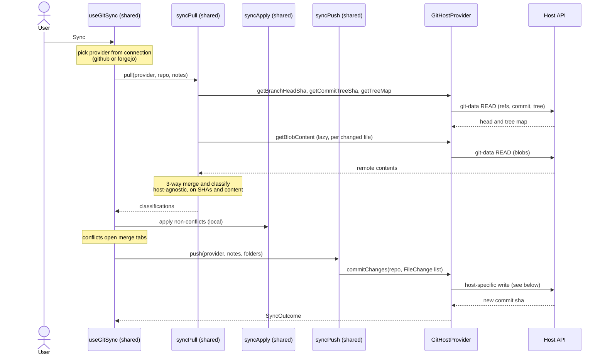
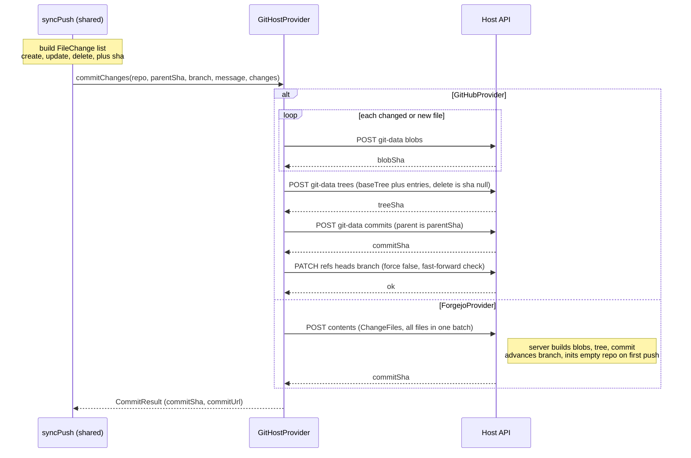

# Multi-host sync: Codeberg / Forgejo (plan)

A plan to add **Codeberg** as a second git host for vault sync, alongside
GitHub. Codeberg runs on **Forgejo** (a Gitea fork), so this is really a
**Forgejo/Gitea** integration — Codeberg is just a preset base URL, and
any self-hosted Forgejo/Gitea instance should work via a configurable URL.

For the current GitHub-only design see [`sync.md`](./sync.md); for the
top-level architecture see [`architecture.md`](./architecture.md). Tracking
issue: rotecodefraktion/noteser#17 (carries the feasibility spike). Upstream
context: ipapakonstantinou/noteser#180.

## Goals

- Use a Codeberg/Forgejo repo as a vault, with the same round-trip and
  three-way merge guarantees we already give GitHub.
- One `ForgejoProvider` that targets the **common Gitea API subset**, so
  it also covers self-hosted Forgejo/Gitea — not a Codeberg special case.
- No regression to GitHub sync: it keeps working unchanged.
- Keep the merge engine, classification, path/serialization helpers, and
  the pull→apply→push orchestration **host-agnostic and untouched**.

## Non-goals (for the first cut)

- OAuth2 / device-flow login for Forgejo — start with a **Personal Access
  Token**. OAuth is a follow-up.
- GitLab / Bitbucket — out of scope here, but the abstraction is meant to
  make them cheaper later.
- Gist / file-history / revert-to-commit features on Forgejo — GitHub-only
  for now; they sit outside the sync seam (see "Surface we are NOT
  abstracting yet").

## Background: the feasibility spike

Full results in issue #17. The load-bearing findings:

- **Read path is compatible.** `git/refs → git/commits → git/trees?recursive
  → git/blobs` maps onto our existing read functions; blobs are base64.
- **Blob SHAs are identical.** Forgejo returns the same git blob SHA
  (`sha1("blob <len>\0<content>")`) our `gitBlobSha` computes — so our
  change-detection works unchanged.
- **Write path differs.** Forgejo/Gitea git-data endpoints are **read-only**
  — there is no `POST /git/blobs|trees|commits` and no `PATCH /git/refs`.
  Writes go through **`POST /repos/{owner}/{repo}/contents`** (the
  `ChangeFiles` batch API): one call writes N files (create/update/delete)
  as a single commit. This was verified end-to-end against a real repo,
  including initializing an empty repo on first push.
- **CORS is open** (`access-control-allow-origin: *`) → the browser can
  call Codeberg directly. **No proxy route is needed** for the data API.

## The seam: `GitHostProvider`

The whole point of the spike is this: the GitHub push flow
(`createBlob → createTree → createCommit → updateBranchRef`) **cannot be
ported to Forgejo** because those create endpoints don't exist. So the
provider seam must NOT expose git-data primitives. It exposes a
**higher-level "commit a batch of file changes"** operation that each host
implements its own way.

```ts
// src/utils/gitHost/types.ts  (new)

export type HostKind = 'github' | 'forgejo'

export interface HostUser {
  id: string | number
  login: string
  name: string | null
  avatarUrl?: string
}

export interface HostRepo {
  owner: string
  name: string
  defaultBranch: string
  isPrivate: boolean
}

/** One file change in a commit. content is the raw UTF-8 string (provider
 *  handles base64). For deletes, content is omitted. sha is the *current*
 *  blob sha of the file being replaced/deleted (Forgejo requires it;
 *  GitHub ignores it). */
export interface FileChange {
  op: 'create' | 'update' | 'delete'
  path: string
  content?: string
  contentBytes?: Uint8Array  // for binary attachments
  sha?: string
}

export interface CommitRequest {
  branch: string
  parentSha: string            // expected current head (optimistic FF)
  message: string
  changes: FileChange[]
}

export interface CommitResult {
  commitSha: string
  commitUrl: string | null
}

export interface GitHostProvider {
  readonly kind: HostKind
  readonly baseUrl: string     // e.g. https://api.github.com | https://codeberg.org

  // --- repo ops ---
  listRepos(): Promise<HostRepo[]>
  getRepo(owner: string, name: string): Promise<HostRepo>
  listBranches(owner: string, name: string): Promise<string[]>
  createRepo(name: string, isPrivate: boolean): Promise<HostRepo>

  // --- git-data READ (near-identical across hosts) ---
  getBranchHeadSha(repo: SyncRepo): Promise<string>
  getCommitTreeSha(repo: SyncRepo, commitSha: string): Promise<string>
  getTreeMap(repo: SyncRepo, treeSha: string): Promise<Map<string, string>>  // path -> blobSha
  getBlobContent(repo: SyncRepo, sha: string): Promise<string>
  getBlobBytes(repo: SyncRepo, sha: string): Promise<Uint8Array>

  // --- git-data WRITE (the one real divergence) ---
  commitChanges(repo: SyncRepo, req: CommitRequest): Promise<CommitResult>
}
```

### How each host implements `commitChanges`

- **GitHub** (`GitHubProvider`): the existing flow, just moved behind the
  method — `createBlob`/`createBlobBinary` per changed file →
  `createTree(baseTree, entries)` (deletes = `sha:null` entry) →
  `createCommit(parent)` → `updateBranchRef(force:false)`.
- **Forgejo** (`ForgejoProvider`): one `POST /contents` with
  `ChangeFilesOptions` — map each `FileChange` to a `ChangeFileOperation`
  (`operation`, `path`, base64 `content`, `sha`), set `branch` + `message`.
  Binary attachments use the same base64 `content` field. Empty repo is
  fine — the first `ChangeFiles` call creates the branch.

Auth is **not** on this interface (it differs too much per host); see below.

## Sequence diagrams

### Full sync: one orchestrator, provider injected

The pull→apply→push pipeline is host-agnostic. It selects a provider from
the active connection and never branches on host kind itself — only the
provider does.



### `commitChanges`: the one host divergence

Same call, two implementations. `syncPush` builds a host-neutral
`FileChange[]`; the provider turns it into commits its host's way.



The GitHub branch is multi-request (N blobs + tree + commit + ref) and
relies on `force:false` for the optimistic fast-forward check. The Forgejo
branch is a single request; the optimistic-concurrency story there is an
open item (does `ChangeFiles` reject when the branch moved under us? — to
confirm in phase 3, otherwise re-pull-and-retry on conflict).

## What stays shared vs host-specific

| Layer | Disposition |
|---|---|
| `githubSync/syncPull.ts`, `syncPush.ts` | **Shared.** Refactor to take a `GitHostProvider` and call `provider.*` instead of importing `github.ts`. Logic unchanged. |
| `githubSync/syncClassify.ts`, `internal.ts` | **Shared, untouched.** Pure classification, path, serialization, merge helpers — already host-agnostic. |
| `hooks/useGitHubSync.ts` | **Shared.** Becomes `useGitSync`; selects the provider from the active connection and injects it. pull→apply→push flow unchanged. |
| `gitBlobSha` / base64 helpers | **Shared.** Verified identical SHA semantics. |
| `github.ts` | **Becomes `GitHubProvider`** behind the interface (a mechanical wrap; existing functions stay, just grouped). |
| Auth (device flow), `/api/github/*` routes | **GitHub-specific, kept as-is.** Forgejo adds PAT entry (no proxy needed — CORS is open). |

> The one structural change to shared code: `syncPush.ts` currently builds
> blobs/tree directly. It must instead build a `FileChange[]` and hand it to
> `provider.commitChanges`. The normalization-churn detection and
> "locally changed?" pre-pass stay; only the final blob/tree/commit/ref
> calls collapse into one provider call. This is the bulk of the work.

## Auth strategy

- **GitHub:** unchanged (OAuth device flow + refresh tokens via the proxy
  routes).
- **Forgejo (first cut): Personal Access Token.** The user pastes a
  repo-scoped token (`read:repository` + `write:repository`). No proxy, no
  device flow. A Codeberg connection is stored as
  `{ kind: 'forgejo', baseUrl: 'https://codeberg.org', token }`.
- **Forgejo (later): OAuth2 authorization-code** via
  `/user/applications/oauth2`. Out of scope for the first cut.

Note: a repo-scoped Codeberg token cannot carry `read:user`, so the
"who am I" lookup (`HostUser`) is only available with an unscoped token or
via OAuth. The first cut should treat `HostUser` as optional — we already
know the repo owner from the connection.

## Data model changes

- **Store** (`githubStore.ts` → `gitHostStore.ts`, or a parallel store):
  tag the connection with `host: HostKind` and `baseUrl`. GitHub stays the
  default; migrate existing persisted state to `host: 'github'`,
  `baseUrl: 'https://api.github.com'`. Persist-key bump + `migrate`.
- **Types** (`types/index.ts`): `SyncRepo` is already host-agnostic (keep).
  Generalize `GitHubUser`/`GitHubRepo` to `HostUser`/`HostRepo`
  (alias the old names during migration to avoid a big rename churn).
- **Note fields** (`gitPath`, `gitLastPushedSha`, `gitRemoteBaseSha`):
  already host-agnostic — keep the names to avoid touching the whole
  sync pipeline; they mean "path/sha in the active host's repo".

## API routes / CORS

- No new server routes needed for Forgejo data calls — Codeberg's API sends
  `access-control-allow-origin: *`, so the browser calls
  `{baseUrl}/api/v1/...` directly.
- The GitHub `zipball` fast-path has a Forgejo equivalent
  (`GET /archive/{ref}.zip`); wire it only if first-clone perf needs it.
  Confirm whether the archive endpoint needs a proxy (it may not send CORS
  for the binary download) — **open item**.

## Surface we are NOT abstracting yet

These import `github.ts` but sit outside the sync seam and stay GitHub-only
for the first cut (they degrade gracefully — just unavailable on a Forgejo
connection):

- `githubGist.ts` (publish-as-gist), `githubHistory.ts` /
  `FileHistoryModal`, `revertToCommit.ts`, and the GitHub-specific bits of
  `SourceControlPanel`.

Gate them on `host === 'github'` in the UI.

## Implementation phases

1. **Provider interface + GitHubProvider wrap.** Define `gitHost/types.ts`,
   wrap existing `github.ts` as `GitHubProvider` (incl. `commitChanges` =
   the current blob/tree/commit/ref flow). No behavior change. Tests green.
2. **Thread the provider through sync.** `syncPull`/`syncPush`/`useGitSync`
   take a `GitHostProvider`. Refactor `syncPush` to build `FileChange[]` →
   `commitChanges`. GitHub path verified unchanged (unit + `e2e:sync`).
3. **ForgejoProvider.** Implement read (refs/commits/trees/blobs) +
   `commitChanges` via `ChangeFiles`. PAT auth. Version probe on connect.
4. **UI.** Host picker + base-URL + PAT entry in the sync setup modal;
   gate GitHub-only features on `host === 'github'`.
5. **Codeberg e2e harness.** `e2e:sync:codeberg` mirroring the GitHub live
   harness, using `~/.config/noteser/codeberg-test-token.env`
   (`CODEBERG_TEST_TOKEN`) against `rotecodefraktion/noteser-codeberg-test`.

Phases 1–2 are pure refactors with the GitHub suite as the safety net;
the Forgejo-specific risk is isolated to phase 3.

## Open questions / risks

- **`syncPush` refactor surface.** Collapsing blob/tree/commit/ref into
  `commitChanges` is the largest shared-code change. Mitigation: phase 1–2
  keep GitHub semantics identical and lean on `e2e:sync`.
- **Large vaults via `ChangeFiles`.** One request carries all changed files
  as base64 — confirm Codeberg's request-size limits and whether we need to
  chunk into multiple commits for big first pushes.
- **Archive/CORS** for the first-clone fast path (above).
- **Rename/move semantics.** GitHub modal `100644` tree entries vs
  Forgejo's `from_path` on `ChangeFileOperation` — map our move handling to
  `from_path` where possible, else delete+create.
- **Older Gitea (<1.17)** lacks the `ChangeFiles` batch; version-probe and
  fall back to per-file `PUT /contents/{path}` (not needed for Codeberg).
- **Optimistic concurrency on Forgejo.** GitHub's `updateBranchRef(force:false)`
  rejects a non-fast-forward push, which is how we detect "branch moved under
  us". Confirm whether `ChangeFiles` fails when the branch advanced past
  `parentSha`; if it can't express that precondition, fall back to a
  re-pull-and-retry on the next sync (the merge engine already handles the
  reconciliation).

## Test strategy

- Phases 1–2: existing Jest unit suites + GitHub `e2e:sync` must stay green
  (they prove the refactor is behavior-preserving).
- Phase 3+: `e2e:sync:codeberg` live round-trip (create/update/delete,
  conflict, first-clone) against the test repo; unit tests for the
  `ChangeFiles` mapping and the version-probe fallback.
